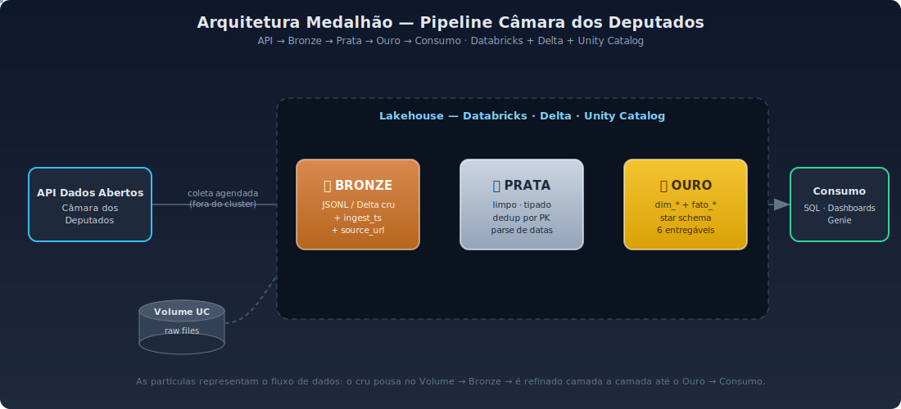

# 🏛️ Bloco 0 — Setup & Fundamentos

> **Especialista do bloco:** Arquiteto de Dados
> **Objetivo:** entender *o que* estamos construindo e *por quê*, montar o ambiente (Databricks + Git + local) e desenhar a arquitetura medalhão **antes** de escrever a primeira linha de ingestão.

---

## 1. Por que este bloco existe

Todo projeto de dados que dá errado costuma ter o mesmo pecado de origem: alguém abriu um notebook e começou a escrever código sem decidir **onde os dados moram, como fluem e quem responde por eles**. O desafio do Fast Track pede explicitamente, como primeiro item, *"desenhar a arquitetura completa da solução"* e *"especificar a arquitetura escolhida e por quê"*.

O Arquiteto de Dados nunca começa pelo código. Começa por três perguntas:
1. **De onde vêm os dados?** (fonte, formato, volume, frequência)
2. **Para onde vão e em que estados?** (camadas, modelo, governança)
3. **Quem consome e com qual garantia?** (qualidade, SLA, custo)

---

## 2. Conceitos em 3 níveis

### 2.1 O que é Engenharia de Dados
- 🟢 **Júnior:** é a disciplina de **mover e transformar dados** de onde nascem (APIs, bancos, arquivos) até onde são úteis (relatórios, modelos, dashboards), de forma confiável.
- 🟡 **Pleno:** o trabalho não é "rodar o ETL", é **garantir contrato**: schema estável, dados corretos, pipeline que se recupera de falha e é mantível por outra pessoa.
- 🔴 **Sênior:** engenharia de dados é **gestão de trade-offs** entre custo, latência, qualidade e complexidade. A melhor solução técnica que estoura orçamento ou ninguém consegue manter é a pior solução.

### 2.2 Data Lake, Data Warehouse e Lakehouse
- 🟢 **Júnior:**
  - *Data Lake* = armazém barato que guarda qualquer arquivo (JSON, CSV, Parquet) em object storage.
  - *Data Warehouse* = banco analítico estruturado, com schema e SQL rápido para BI.
  - *Lakehouse* = junção dos dois: a flexibilidade/custo do lake **com** as garantias do warehouse.
- 🟡 **Pleno:** o lakehouse resolve o problema clássico de manter *dois* sistemas (lake + warehouse) sincronizados. Uma fonte de verdade, em object storage, com transações ACID por cima.
- 🔴 **Sênior:** o que torna isso possível é um **formato de tabela aberto** (Delta, Iceberg, Hudi) que adiciona um *log de transações* sobre os arquivos Parquet. Você ganha ACID, versionamento e *schema evolution* sem abrir mão de armazenamento barato e aberto.

### 2.3 Delta Lake
- 🟢 **Júnior:** é o formato de tabela padrão do Databricks. Por baixo são arquivos **Parquet** + um **log de transações** (`_delta_log`).
- 🟡 **Pleno:** esse log dá **ACID** (escritas atômicas, sem ler dado pela metade), **Time Travel** (consultar a tabela como ela era ontem) e **MERGE/UPSERT** (essencial para carga incremental e SCD2).
- 🔴 **Sênior:** o log permite *otimizações* (compaction/OPTIMIZE, Z-ORDER, data skipping via estatísticas) e é a base técnica de Time Travel para **reprocessamento e auditoria** — exatamente o que o desafio cobra em "rastrear origem e evolução dos dados".

### 2.4 Unity Catalog e Volumes
- 🟢 **Júnior:** o **Unity Catalog (UC)** é a camada de governança. Tudo vive num namespace de três níveis: `catalogo.schema.tabela`. **Volumes** são pastas governadas pelo UC para guardar **arquivos** (não-tabelas), como nossos JSONL crus.
- 🟡 **Pleno:** o UC centraliza **permissões e linhagem** (quem acessa o quê, e de onde cada coluna veio). Volume é onde a ingestão "pousa" o dado bruto antes de virar Delta.
- 🔴 **Sênior:** separar **storage governado** (Volume) de **tabela** (Delta) é o que viabiliza a arquitetura real onde a *coleta roda fora do cluster* e só entrega arquivos no Volume; o cluster consome dali. Governança e custo ficam desacoplados do processamento.

### 2.5 Arquitetura Medalhão (Bronze / Prata / Ouro)
- 🟢 **Júnior:**
  - **Bronze** = dado cru, como veio da fonte.
  - **Prata (Silver)** = limpo, tipado, deduplicado.
  - **Ouro (Gold)** = pronto para o negócio (fatos, dimensões, métricas).
- 🟡 **Pleno:** cada camada tem **uma responsabilidade só**. Bronze nunca transforma regra de negócio (só audita); Gold nunca reprocessa dado sujo. Isso isola falhas e facilita reprocessar uma camada sem refazer tudo.
- 🔴 **Sênior:** a medalhão é uma forma de **idempotência e replay por estágio**: se a Gold quebrou, eu reconstruo a partir da Prata; se a fonte mudou, eu recoletо a Bronze sem perder o histórico. É a arquitetura que o desafio "recomenda seguir" — e saber *defender por que* vale mais que segui-la cegamente.

---

## 3. Decisão de ambiente — Databricks (atualizado jun/2026)

> ⚠️ Mudança importante: a antiga **Community Edition foi aposentada em 01/01/2026**. O substituto gratuito é o **Databricks Free Edition**.

| | **Free Edition** (gratuito) | **Workspace corporativo** (pago) |
|---|---|---|
| Compute | **Serverless apenas** (sem cluster customizado, sem GPU) | Clusters dedicados, escolha de runtime, GPU |
| Recursos | SQL, Python, **DLT/ETL workflows**, Dashboards, Genie, Assistant | Tudo + escala de produção, jobs grandes, SLAs |
| Unity Catalog / Volumes | Sim | Sim |
| Quem usa | Estudantes, hobbyistas, **aprendizado** | Times em produção |
| Limites | Cotas de uso, sem configs avançadas de compute | Conforme contrato |

**Recomendação para a trilha:** o **Free Edition é suficiente e até ideal** — ele é serverless e já suporta Delta, Unity Catalog, Volumes e **DLT** (que precisaremos nos blocos 5 e 6). Use o corporativo só se você já tiver um e quiser testar escala real.

### Passo a passo do setup
1. Criar conta no **Databricks Free Edition** (login Google/e-mail).
2. Confirmar que existe um **catálogo** e um **schema** para o projeto (ex.: `camara` / `bronze`, `silver`, `gold`).
3. Criar um **Volume** no UC para os arquivos crus (ex.: `camara.bronze.raw`).
4. Conectar o **repositório Git** via *Git folder* (Repos) para versionar os notebooks.
5. No ambiente **local**, criar a venv e instalar dependências (`requests`, `pandas`, `pyarrow`, `pytest`) para iterar rápido sem subir Spark a cada teste.

---

## 4. O desenho da arquitetura (defesa da solução)

> 🎬 O diagrama acima é um **SVG animado dedicado** (`trilha/arquitetura.svg`): as partículas mostram o dado fluindo da API → Volume → Bronze → Prata → Ouro → Consumo. Abra o arquivo no navegador para ver a animação.

**Por que esta arquitetura (a defesa que se espera numa banca/entrevista):**
- **Medalhão** porque isola responsabilidades e permite *replay por camada* — pedido direto do desafio.
- **Coleta fora do cluster** porque a API é I/O-bound (esperar rede), e pagar compute parado esperando HTTP é desperdício; o cluster foca em processar.
- **Campos de auditoria desde a Bronze** (`ingest_ts`, `source_url`) porque rastrear origem/linhagem é requisito explícito.
- **Delta + Time Travel** para reprocessamento e reconstrução histórica, base dos desafios de CDC/SCD2.

---

## ✅ O que você aprendeu neste bloco
- O papel do Arquiteto de Dados: decidir origem, fluxo e governança **antes** do código.
- A diferença entre Data Lake, Warehouse e **Lakehouse**, e por que o lakehouse vence ao manter uma só fonte de verdade.
- O que é **Delta Lake** (Parquet + log de transações) e o que ele habilita (ACID, Time Travel, MERGE).
- **Unity Catalog** e **Volumes** como camada de governança e ponto de pouso do dado cru.
- A **arquitetura medalhão** e como *defender* cada decisão.
- O estado atual do Databricks gratuito (**Free Edition**, serverless) e como montar o ambiente.

## 🎯 O que você deveria dominar para seguir
- Conseguir **desenhar de cabeça** o fluxo API → Bronze → Silver → Gold → Consumo.
- Explicar, em uma frase cada, o propósito de cada camada medalhão.
- Saber por que `ingest_ts` e `source_url` entram já na Bronze.
- Ter o ambiente pronto: conta Free Edition, catálogo/schema, Volume, Git folder e venv local.

## 📝 Quiz certo/errado (gabarito comentado)
1. *"A camada Bronze já deve aplicar regras de negócio e limpeza."*
   ❌ **Errado.** Bronze guarda o dado **cru**; só adiciona auditoria. Limpeza é trabalho da Silver.
2. *"Delta Lake substitui o Parquet por um formato proprietário fechado."*
   ❌ **Errado.** Delta **usa** Parquet por baixo e adiciona um log de transações; é um formato **aberto**.
3. *"Time Travel permite consultar o estado de uma tabela em uma versão/data anterior."*
   ✅ **Certo.** É o que habilita auditoria e reprocessamento.
4. *"No Databricks Free Edition você cria clusters customizados com GPU."*
   ❌ **Errado.** Free Edition é **serverless apenas**, sem compute customizado nem GPU.
5. *"Volumes do Unity Catalog servem para guardar arquivos não-tabulares, como JSONL cru."*
   ✅ **Certo.** Volume é storage governado para arquivos; tabelas Delta são outra coisa.

## 🎤 Perguntas de entrevista (com resposta-modelo)

**🟢 Júnior — "Explique a arquitetura medalhão."**
> São três camadas: Bronze guarda o dado cru como veio da fonte; Silver limpa, tipa e remove duplicatas; Gold organiza em fatos e dimensões prontos para análise. Cada camada tem uma responsabilidade clara, o que facilita achar e corrigir problemas.

**🟡 Pleno — "Por que não aplicar a limpeza já na ingestão e pular a Bronze?"**
> Porque perderíamos o dado original. Se uma regra de limpeza estiver errada, ou se eu precisar reprocessar com lógica nova, preciso da fonte crua preservada. A Bronze é meu ponto de recuperação e minha evidência de linhagem (`ingest_ts`, `source_url`). Misturar coleta e transformação também acopla falhas que deveriam ser isoladas.

**🔴 Sênior — "Por que rodar a coleta da API fora do cluster Databricks? Quais os trade-offs?"**
> A coleta é I/O-bound: passa a maior parte do tempo esperando resposta HTTP e respeitando rate limit. Manter um cluster ligado para isso paga compute ocioso. Separando — um job leve (Lambda/Airflow/cron) entrega arquivos no Volume e o cluster consome dali — eu otimizo custo, deixo o cluster focado em processamento pesado, e ganho granularidade de segurança e escala independente. O trade-off é mais peças móveis para orquestrar e monitorar; por isso isso vem acompanhado de runbook e alertas. Para o volume deste desafio, a versão local em pandas já reproduz o conceito sem essa complexidade.

---

### ➡️ Próximo: **Bloco 1 — Ingestão / Bronze** (Engenheiro de Ingestão): construir o cliente da API com paginação, retry e fan-out, e gravar o cru com auditoria.
